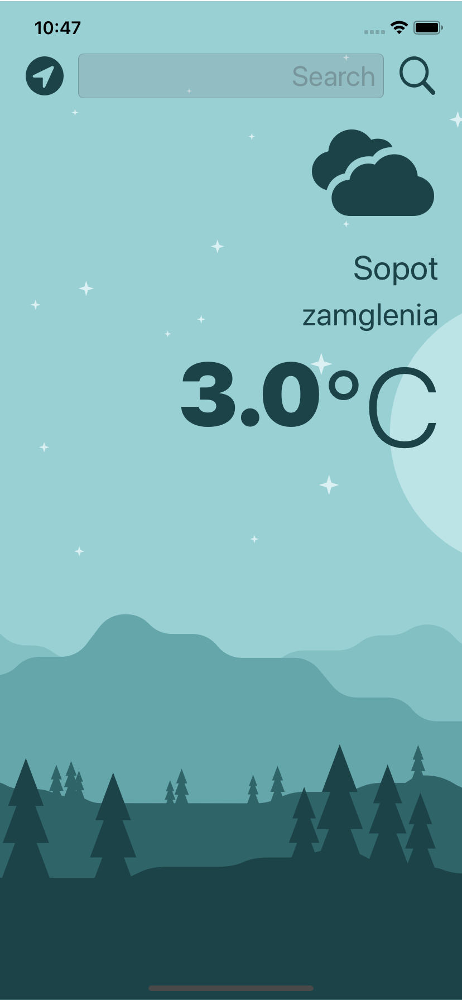
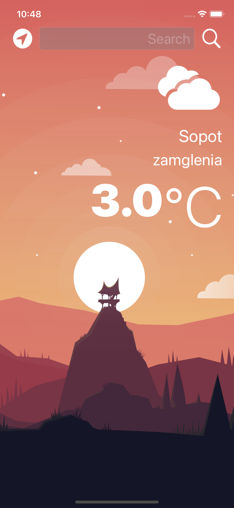

#  WeatherApp

## What was created

Based on App Brewery code I've made a beautiful, dark-mode enabled weather app. It's possible to check the weather for the current location based on the GPS data from the iPhone as well as by searching for a city manually. 

## What I've learned

* How to create a dark-mode enabled app.
* How to use vector images as image assets.
* Learn to use the UITextField to get user input. 
* Learn about the delegate pattern.
* Swift protocols and extensions. 
* Swift guard keyword. 
* Swift computed properties.
* Swift closures and completion handlers.
* Learn to use Alamofire and make GET HTTP requests.
* Parse JSON with the native Encodable and Decodable protocols. 
* Learn to use Grand Central Dispatch to fetch the main thread.
* Learn to use Core Location to get the current location from the phone GPS. 

>This is a companion project to The App Brewery's Complete App Development Bootcamp, check out the full course at [www.appbrewery.co](https://www.appbrewery.co/)

